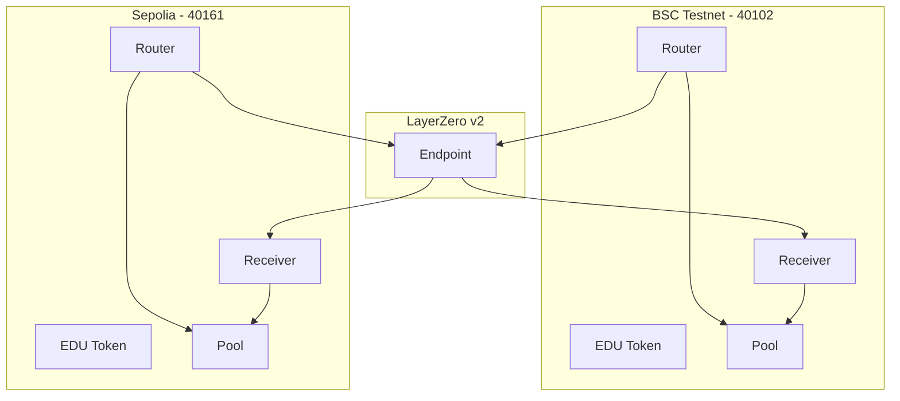

# xChange - Cross-Chain Token Bridge

A cross-chain token swap system using LayerZero to enable token transfers between BSC Testnet and Sepolia networks.

## Contract Addresses

### BSC Testnet

- EDU Token: `0x072E0323722d56ca3836bE716933c7dc7dceC322`
- EDUSwapPool: `0xFfE30090682ea6Ee5F85ac1acD145f4f3DCFF46C`
- EDUSwapReceiver: `0x414089509d9162ae76BE5a197153F36A60c01bb1`
- EDUSwapRouter: `0xD0404B0F6BaB1a6553F06Ce7D12831cA0655C10B`

### Sepolia

- EDU Token: `0xc641Ba315c0018A68800e5c496e27821b52FAEE5`
- EDUSwapPool: `0xAB2D839FbD1669006220F84780677eBa90B4c1e5`
- EDUSwapReceiver: `0x3b403B358034B0055A94C3C72a55c9870679B188`
- EDUSwapRouter: `0xD769e3e05F6c527BA6a955C5dFC0EF400dE84568`

## Setup Guide

1. Environment Configuration

```bash
# Configure .env file
PRIVATE_KEY=your_private_key
BSC_TESTNET_URL=your_bsc_testnet_url
SEPOLIA_URL=your_sepolia_url
```

2. Contract Deployment

```bash
# Deploy to BSC Testnet
npx hardhat run scripts/deploy.ts --network bscTestnet

# Deploy to Sepolia
npx hardhat run scripts/deploy.ts --network sepolia
```

3. Pool Receiver Setup

```bash
# Set Pool Receiver on BSC Testnet
npx hardhat run scripts/setPoolReceiver.ts --network bscTestnet

# Set Pool Receiver on Sepolia
npx hardhat run scripts/setPoolReceiver.ts --network sepolia
```

4. Router and Receiver Peer Setup

```bash
# Set peers on BSC Testnet
npx hardhat run scripts/setPeer.ts --network bscTestnet

# Set peers on Sepolia
npx hardhat run scripts/setPeer.ts --network sepolia
```

## Testing Swaps

From BSC Testnet to Sepolia:

```bash
npx hardhat run scripts/testSwap.ts --network bscTestnet
```

From Sepolia to BSC Testnet:

```bash
npx hardhat run scripts/testSwap.ts --network sepolia
```

## Core Components

### EDUSwapRouter

- Handles cross-chain message transmission
- Transfers user tokens to Pool
- Sends messages to destination chain's Receiver via LayerZero

### EDUSwapReceiver

- Processes LayerZero message reception
- Withdraws tokens from Pool and transfers to users
- Maintains security through peer verification

### EDUSwapPool

- Manages token liquidity
- Controls Receiver's withdrawal permissions
- Handles fee collection and distribution

## Important Setup Notes

1. Pool Receiver Configuration Required

   - Receiver address must be set for Pool token withdrawals
   - Use `setPoolReceiver.ts` script for configuration

2. Router and Receiver Peer Setup Required

   - Peer setup needed for bi-directional message transfer
   - Use `setPeer.ts` script for both networks

3. Gas Fee Requirements
   - LayerZero message transmission requires gas fees
   - Check estimated gas fees and ensure sufficient native tokens

## Troubleshooting

1. "Only receiver can withdraw" Error

   - Occurs when Pool's Receiver address is not set
   - Resolution: Run `setPoolReceiver.ts` script

2. "Peer not set" Error
   - Occurs when Router and Receiver peers are not configured
   - Resolution: Run `setPeer.ts` script

## Project Structure

```
contracts/
├── EDUSwapRouter.sol    - Cross-chain message sending
├── EDUSwapReceiver.sol  - Cross-chain message receiving
└── EDUSwapPool.sol      - Token liquidity management

scripts/
├── deploy.ts            - Contract deployment
├── setPoolReceiver.ts   - Pool receiver setup
├── setPeer.ts          - Peer configuration
└── testSwap.ts         - Swap testing
```

## LayerZero v2 Configuration

### Chain IDs

- BSC Testnet: 40102
- Sepolia: 40161

### Endpoint Addresses

- BSC Testnet: `0x6EDCE65403992e310A62460808c4b910D972f10f`
- Sepolia: `0x6EDCE65403992e310A62460808c4b910D972f10f`

## Architecture Diagram

### Component Structure



## License

This project is licensed under the MIT License.

Copyright (c) 2024 xChange. All rights reserved.
