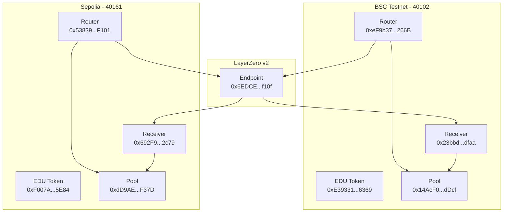

# EDU Bridge v2

크로스체인 EDU 토큰 스왑 시스템입니다. LayerZero를 사용하여 BSC Testnet과 Sepolia 네트워크 간의 토큰 스왑을 지원합니다.

## 컨트랙트 주소

### BSC Testnet

- EDU Token: `0x072E0323722d56ca3836bE716933c7dc7dceC322`
- EDUSwapPool: `0xFfE30090682ea6Ee5F85ac1acD145f4f3DCFF46C`
- EDUSwapReceiver: `0x414089509d9162ae76BE5a197153F36A60c01bb1`
- EDUSwapRouter: `0xD0404B0F6BaB1a6553F06Ce7D12831cA0655C10B`

### Sepolia

- EDU Token: `0xc641Ba315c0018A68800e5c496e27821b52FAEE5`
- EDUSwapPool: `0xAB2D839FbD1669006220F84780677eBa90B4c1e5`
- EDUSwapReceiver: `0x3b403B358034B0055A94C3C72a55c9870679B188`
- EDUSwapRouter: `0xD769e3e05F6c527BA6a955C5dFC0EF400dE84568`

## 설정 방법

1. 환경 설정

```bash
# .env 파일 설정
PRIVATE_KEY=your_private_key
BSC_TESTNET_URL=your_bsc_testnet_url
SEPOLIA_URL=your_sepolia_url
```

2. 컨트랙트 배포

```bash
# BSC Testnet 배포
npx hardhat run scripts/deploy.ts --network bscTestnet

# Sepolia 배포
npx hardhat run scripts/deploy.ts --network sepolia
```

3. Pool에 Receiver 설정

```bash
# BSC Testnet Pool에 Receiver 설정
npx hardhat run scripts/setPoolReceiver.ts --network bscTestnet

# Sepolia Pool에 Receiver 설정
npx hardhat run scripts/setPoolReceiver.ts --network sepolia
```

4. Router와 Receiver 간 피어 설정

```bash
# BSC Testnet 피어 설정
npx hardhat run scripts/setPeer.ts --network bscTestnet

# Sepolia 피어 설정
npx hardhat run scripts/setPeer.ts --network sepolia
```

## 스왑 테스트

BSC Testnet에서 Sepolia로 스왑:

```bash
npx hardhat run scripts/testSwap.ts --network bscTestnet
```

Sepolia에서 BSC Testnet으로 스왑:

```bash
npx hardhat run scripts/testSwap.ts --network sepolia
```

## 주요 기능

### EDUSwapRouter

- 크로스체인 메시지 전송을 처리
- 사용자의 토큰을 Pool로 전송
- LayerZero를 통해 대상 체인의 Receiver에 메시지 전송

### EDUSwapReceiver

- LayerZero 메시지 수신 및 처리
- Pool에서 토큰 인출하여 사용자에게 전송
- 피어 검증을 통한 보안 유지

### EDUSwapPool

- 토큰 유동성 관리
- Receiver의 토큰 인출 권한 관리
- 수수료 수집 및 분배

## 설정 시 주의사항

1. Pool의 Receiver 설정이 필수

   - Pool에서 토큰 인출을 위해 Receiver 주소가 반드시 설정되어야 함
   - `setPoolReceiver.ts` 스크립트로 설정

2. Router와 Receiver의 피어 설정이 필수

   - 양방향 메시지 전송을 위해 피어 설정이 필요
   - `setPeer.ts` 스크립트로 양쪽 네트워크 모두 설정

3. 충분한 가스비 확보
   - LayerZero 메시지 전송에는 가스비가 필요
   - 스왑 시 예상 가스비를 확인하고 충분한 네이티브 토큰 준비

## 트러블슈팅

1. "Only receiver can withdraw" 에러

   - Pool의 Receiver 주소가 설정되지 않은 경우 발생
   - `setPoolReceiver.ts` 스크립트로 해결

2. "Peer not set" 에러
   - Router와 Receiver 간 피어 설정이 되지 않은 경우 발생
   - `setPeer.ts` 스크립트로 해결

## 라이센스

MIT License

## Features

- Bi-directional EDU token transfer between BSC and Sepolia chains
- Secure message delivery through LayerZero protocol
- Liquidity pool-based token management

## Project Structure

```
contracts/
├── EDUSwapRouter.sol    - Cross-chain message sending
├── EDUSwapReceiver.sol  - Cross-chain message receiving
└── EDUSwapPool.sol      - Token liquidity management

scripts/
├── deploy.ts            - Contract deployment
└── swap-test.ts         - Swap testing

test/
└── swap.test.ts         - Test suite
```

## Installation

```bash
npm install
```

## Configuration

Create a `.env` file and set the following values:

```env
PRIVATE_KEY=your_private_key_here
BSC_RPC_URL=https://data-seed-prebsc-1-s1.binance.org:8545/
SEPOLIA_RPC_URL=https://sepolia.infura.io/v3/your_key
LAYERZERO_ENDPOINT=your_layerzero_endpoint
```

## Testing

```bash
npx hardhat test
```

## Deployment

Deploy to BSC Testnet:

```bash
npx hardhat run scripts/deploy.ts --network bsc_testnet
```

Deploy to Sepolia:

```bash
npx hardhat run scripts/deploy.ts --network sepolia
```

## Contract Addresses

### BSC Testnet

- EDU Token: `0xE39331eCe138462a8974c8315Ac455885d4b6369`
- Pool: `0x14AcF0BeAF49A23e5a7157c7f81B1DE25651dDcf`
- Router: `0xeF9b375711163031009Fc7Ab1FA54E4CF7aE266B`
- Receiver: `0x23bbddc963A58f4BfAcCB113465adD60d9c5dfaa`

### Sepolia

- EDU Token: `0xF007Ae40c3BefC533A1a9308ae9f5fc69FBA5E84`
- Pool: `0xdD9AE5debdaBA2971F47171eC5BB818CfD11F37D`
- Router: `0x53839925DBaeF11976F9c8b1f63649d12f84F101`
- Receiver: `0x692F9c6502B21B6915556317A11AE850eC8b2c79`

## License

This project is licensed under the Creative Commons Attribution-NonCommercial-ShareAlike 4.0 International License (CC BY-NC-SA 4.0).

This means you are free to:

- Share: Copy and redistribute the material in any medium or format
- Adapt: Remix, transform, and build upon the material

Under the following terms:

- Attribution: You must give appropriate credit, provide a link to the license, and indicate if changes were made
- NonCommercial: You may not use the material for commercial purposes
- ShareAlike: If you remix, transform, or build upon the material, you must distribute your contributions under the same license as the original

For more details, see the full license text at:
https://creativecommons.org/licenses/by-nc-sa/4.0/

Copyright (c) 2025 Xchange. All rights reserved.

## Architecture

### Contract Structure

1. **EDU Token (MockEDUToken)**

   - ERC20 token
   - Mock token for testing

2. **EDUSwapPool**

   - Liquidity pool management
   - Token deposit and withdrawal
   - Fee handling (0.5%)
   - Router and Receiver address management

3. **EDUSwapRouter**

   - Inherits LayerZero v2 OApp
   - Cross-chain swap initiation
   - Fee calculation and processing
   - Communication with destination chain's Receiver

4. **EDUSwapReceiver**
   - Inherits LayerZero v2 OApp
   - Cross-chain message reception
   - Token withdrawal from Pool and transfer to user

### Swap Process

1. User calls Router's `swap` function
2. Router transfers tokens to Pool and processes fees
3. Router sends message to destination chain's Receiver through LayerZero
4. Receiver receives message and transfers tokens from Pool to user

## Setup

### Environment Setup

```bash
npm install
cp .env.example .env
# Fill in required values in .env file
```

### Contract Deployment

```bash
npx hardhat run scripts/deploy.ts --network bscTestnet
npx hardhat run scripts/deploy.ts --network sepolia
```

### Peer Setup

```bash
npx hardhat run scripts/setPeers.ts --network bscTestnet
npx hardhat run scripts/setPeers.ts --network sepolia
```

## Testing

### Cross-chain Swap Testing

```bash
# BSC Testnet -> Sepolia
npx hardhat run scripts/testSwap.ts --network bscTestnet

# Sepolia -> BSC Testnet
npx hardhat run scripts/testSwap.ts --network sepolia
```

## LayerZero v2 Configuration

### Chain IDs

- BSC Testnet: 40102
- Sepolia: 40161

### Endpoint Addresses

- BSC Testnet: `0x6EDCE65403992e310A62460808c4b910D972f10f`
- Sepolia: `0x6EDCE65403992e310A62460808c4b910D972f10f`

## Architecture Diagram

### Component Structure


