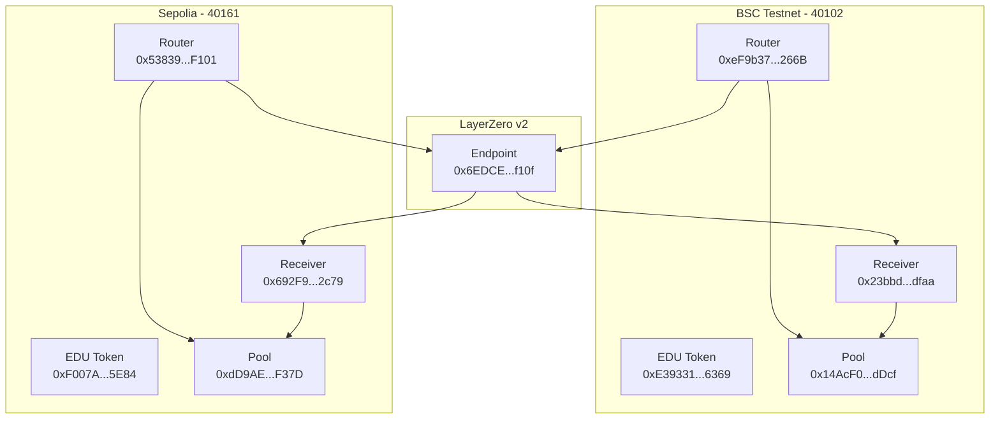
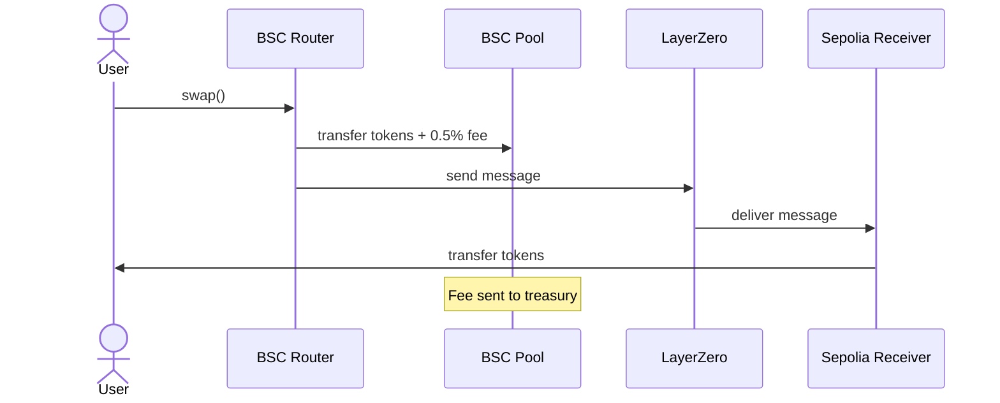
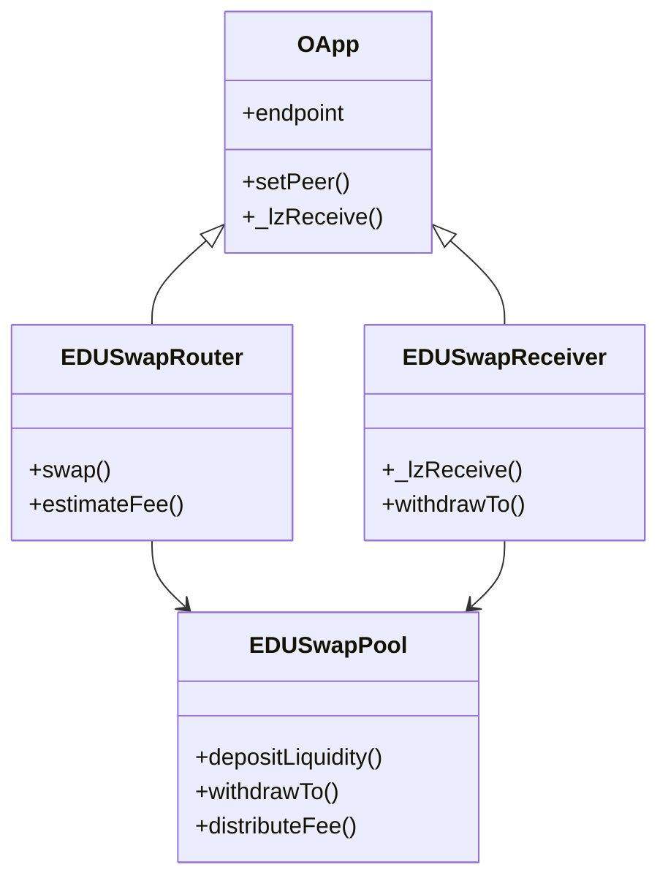

# EDUBridge v2

LayerZero v2를 사용한 크로스체인 EDU 토큰 브릿지 프로젝트입니다.

## 기능

- BSC ↔ Sepolia 체인 간 EDU 토큰 양방향 전송
- LayerZero 프로토콜을 통한 안전한 메시지 전달
- 유동성 풀 기반 토큰 관리

## 프로젝트 구조

```
contracts/
├── EDUSwapRouter.sol    - 크로스체인 메시지 전송
├── EDUSwapReceiver.sol  - 크로스체인 메시지 수신
└── EDUSwapPool.sol      - 토큰 유동성 관리

scripts/
├── deploy.ts            - 컨트랙트 배포
└── swap-test.ts         - 스왑 테스트

test/
└── swap.test.ts         - 테스트 스위트
```

## 설치

```bash
npm install
```

## 환경 설정

`.env` 파일을 생성하고 다음 값들을 설정하세요:

```env
PRIVATE_KEY=your_private_key_here
BSC_RPC_URL=https://data-seed-prebsc-1-s1.binance.org:8545/
SEPOLIA_RPC_URL=https://sepolia.infura.io/v3/your_key
LAYERZERO_ENDPOINT=your_layerzero_endpoint
```

## 테스트

```bash
npx hardhat test
```

## 배포

BSC Testnet에 배포:

```bash
npx hardhat run scripts/deploy.ts --network bsc_testnet
```

Sepolia에 배포:

```bash
npx hardhat run scripts/deploy.ts --network sepolia
```

## 컨트랙트 주소

### BSC Testnet

- EDU Token: `0xE39331eCe138462a8974c8315Ac455885d4b6369`
- Pool: `0x14AcF0BeAF49A23e5a7157c7f81B1DE25651dDcf`
- Router: `0xeF9b375711163031009Fc7Ab1FA54E4CF7aE266B`
- Receiver: `0x23bbddc963A58f4BfAcCB113465adD60d9c5dfaa`

### Sepolia

- EDU Token: `0xF007Ae40c3BefC533A1a9308ae9f5fc69FBA5E84`
- Pool: `0xdD9AE5debdaBA2971F47171eC5BB818CfD11F37D`
- Router: `0x53839925DBaeF11976F9c8b1f63649d12f84F101`
- Receiver: `0x692F9c6502B21B6915556317A11AE850eC8b2c79`

## 라이선스

MIT

## 아키텍처

### 컨트랙트 구조

1. **EDU Token (MockEDUToken)**

   - ERC20 토큰
   - 테스트를 위한 Mock 토큰

2. **EDUSwapPool**

   - 유동성 풀 관리
   - 토큰 예치 및 출금
   - 수수료 처리 (0.5%)
   - Router와 Receiver 주소 관리

3. **EDUSwapRouter**

   - LayerZero v2 OApp 상속
   - 크로스체인 스왑 시작점
   - 수수료 계산 및 처리
   - 목적지 체인의 Receiver와 통신

4. **EDUSwapReceiver**
   - LayerZero v2 OApp 상속
   - 크로스체인 메시지 수신
   - Pool에서 토큰 출금하여 사용자에게 전송

### 스왑 프로세스

1. 사용자가 Router의 `swap` 함수 호출
2. Router가 토큰을 Pool로 전송하고 수수료 처리
3. Router가 LayerZero를 통해 목적지 체인의 Receiver에게 메시지 전송
4. Receiver가 메시지를 수신하고 Pool에서 토큰을 출금하여 사용자에게 전송

## 설정

### 환경 설정

```bash
npm install
cp .env.example .env
# .env 파일에 필요한 값들을 입력
```

### 컨트랙트 배포

```bash
npx hardhat run scripts/deploy.ts --network bscTestnet
npx hardhat run scripts/deploy.ts --network sepolia
```

### 피어 설정

```bash
npx hardhat run scripts/setPeers.ts --network bscTestnet
npx hardhat run scripts/setPeers.ts --network sepolia
```

## 테스트

### 크로스체인 스왑 테스트

```bash
# BSC Testnet -> Sepolia
npx hardhat run scripts/testSwap.ts --network bscTestnet

# Sepolia -> BSC Testnet
npx hardhat run scripts/testSwap.ts --network sepolia
```

## LayerZero v2 설정

### 체인 ID

- BSC Testnet: 40102
- Sepolia: 40161

### Endpoint 주소

- BSC Testnet: `0x6EDCE65403992e310A62460808c4b910D972f10f`
- Sepolia: `0x6EDCE65403992e310A62460808c4b910D972f10f`

## 아키텍처 다이어그램

### 컴포넌트 구조



### BSC -> Sepolia 스왑 프로세스



### Sepolia -> BSC 스왑 프로세스


### 컨트랙트 상속 구조


