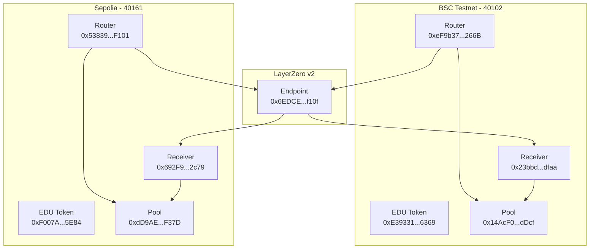

# EDUBridge v2

A cross-chain EDU token bridge project using LayerZero v2.

## Features

- Bi-directional EDU token transfer between BSC and Sepolia chains
- Secure message delivery through LayerZero protocol
- Liquidity pool-based token management

## Project Structure

```
contracts/
├── EDUSwapRouter.sol    - Cross-chain message sending
├── EDUSwapReceiver.sol  - Cross-chain message receiving
└── EDUSwapPool.sol      - Token liquidity management

scripts/
├── deploy.ts            - Contract deployment
└── swap-test.ts         - Swap testing

test/
└── swap.test.ts         - Test suite
```

## Installation

```bash
npm install
```

## Configuration

Create a `.env` file and set the following values:

```env
PRIVATE_KEY=your_private_key_here
BSC_RPC_URL=https://data-seed-prebsc-1-s1.binance.org:8545/
SEPOLIA_RPC_URL=https://sepolia.infura.io/v3/your_key
LAYERZERO_ENDPOINT=your_layerzero_endpoint
```

## Testing

```bash
npx hardhat test
```

## Deployment

Deploy to BSC Testnet:

```bash
npx hardhat run scripts/deploy.ts --network bsc_testnet
```

Deploy to Sepolia:

```bash
npx hardhat run scripts/deploy.ts --network sepolia
```

## Contract Addresses

### BSC Testnet

- EDU Token: `0xE39331eCe138462a8974c8315Ac455885d4b6369`
- Pool: `0x14AcF0BeAF49A23e5a7157c7f81B1DE25651dDcf`
- Router: `0xeF9b375711163031009Fc7Ab1FA54E4CF7aE266B`
- Receiver: `0x23bbddc963A58f4BfAcCB113465adD60d9c5dfaa`

### Sepolia

- EDU Token: `0xF007Ae40c3BefC533A1a9308ae9f5fc69FBA5E84`
- Pool: `0xdD9AE5debdaBA2971F47171eC5BB818CfD11F37D`
- Router: `0x53839925DBaeF11976F9c8b1f63649d12f84F101`
- Receiver: `0x692F9c6502B21B6915556317A11AE850eC8b2c79`

## License

This project is licensed under the Creative Commons Attribution-NonCommercial-ShareAlike 4.0 International License (CC BY-NC-SA 4.0).

This means you are free to:

- Share: Copy and redistribute the material in any medium or format
- Adapt: Remix, transform, and build upon the material

Under the following terms:

- Attribution: You must give appropriate credit, provide a link to the license, and indicate if changes were made
- NonCommercial: You may not use the material for commercial purposes
- ShareAlike: If you remix, transform, or build upon the material, you must distribute your contributions under the same license as the original

For more details, see the full license text at:
https://creativecommons.org/licenses/by-nc-sa/4.0/

Copyright (c) 2024 EDUBridge. All rights reserved.

## Architecture

### Contract Structure

1. **EDU Token (MockEDUToken)**

   - ERC20 token
   - Mock token for testing

2. **EDUSwapPool**

   - Liquidity pool management
   - Token deposit and withdrawal
   - Fee handling (0.5%)
   - Router and Receiver address management

3. **EDUSwapRouter**

   - Inherits LayerZero v2 OApp
   - Cross-chain swap initiation
   - Fee calculation and processing
   - Communication with destination chain's Receiver

4. **EDUSwapReceiver**
   - Inherits LayerZero v2 OApp
   - Cross-chain message reception
   - Token withdrawal from Pool and transfer to user

### Swap Process

1. User calls Router's `swap` function
2. Router transfers tokens to Pool and processes fees
3. Router sends message to destination chain's Receiver through LayerZero
4. Receiver receives message and transfers tokens from Pool to user

## Setup

### Environment Setup

```bash
npm install
cp .env.example .env
# Fill in required values in .env file
```

### Contract Deployment

```bash
npx hardhat run scripts/deploy.ts --network bscTestnet
npx hardhat run scripts/deploy.ts --network sepolia
```

### Peer Setup

```bash
npx hardhat run scripts/setPeers.ts --network bscTestnet
npx hardhat run scripts/setPeers.ts --network sepolia
```

## Testing

### Cross-chain Swap Testing

```bash
# BSC Testnet -> Sepolia
npx hardhat run scripts/testSwap.ts --network bscTestnet

# Sepolia -> BSC Testnet
npx hardhat run scripts/testSwap.ts --network sepolia
```

## LayerZero v2 Configuration

### Chain IDs

- BSC Testnet: 40102
- Sepolia: 40161

### Endpoint Addresses

- BSC Testnet: `0x6EDCE65403992e310A62460808c4b910D972f10f`
- Sepolia: `0x6EDCE65403992e310A62460808c4b910D972f10f`

## Architecture Diagram

### Component Structure


